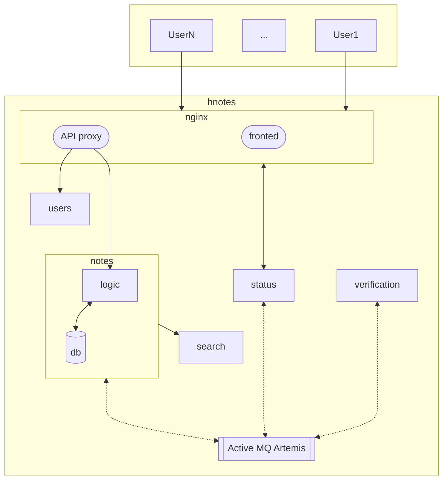

# hNOTES

The place to keep your notes and ideas organized.

## About the project

This is a playground project to explore technologies, tools and good patterns to build scalable distributed systems.
Even though it's not intended to be ever put into real production, the general aim is to keep it as close to real solutions as possible.

hNotes are experimental; the design might (and probably will) change over time, perhaps even the domain itself (memo-taking app) might morph into something else.

# Components

In order to keep the development process as simple as possible, I decided to keep all the code in a single repository.

*In a real system it would probably be best to split components into separate repositories and use git submodules, git repo or other tools to bring all the elements together*.

The current structure of the system is depicted in the diagram below:

## Frontend application

Users interact with the sNotes ystem via the [frontend web application](frontend) implemented in [Angular](https://angular.dev/).

It allows user to log into the system, view existing notes and edit them: create new ones, update or delete existing ones.

Under the hood it communicates with [Users](#users-service) and [Notes](#notes-service) services hidden behind the proxy API provided by [nginx](k8s/dockerfiles/frontend/default.conf.template).

Uses [Angular Material](https://material.angular.io/) components.

### Future plans
- [ ] Search functionality
- [ ] Improved login form verification
- [ ] Websocket connections with [Status](#status-service) service for async updates
- [ ] Frontend for managing users

## Notes Service

[Notes](backend/notes_service) is the main service in the system exposing API for managing notes.
*Due to the nature of the system, this service will probably be the most loaded one and should be considered the first to scale horizontally.*

The data itself is kept in a database that is accessed in the code via a [hibernate-based interface](/backend/notes_service/src/main/java/houen/hnotes/NotesRepository.java).
*For the time being, a "standard" SQL DBMS is being used, but to improve future performance a plan is to adpot a noSQL backaned and switch to fully reactive (WebFlux) flow.*

To provide a more complex functionality, the service integrates with additional components as described in the following sections.

### Search Service integration

[Search](#search-service) support is provided by a third-party service running [ElasticSearch](http://elastic.co).

**WIP**

Each new note added to `Notes` is additionally indexed in `Search` so that it can be later fetched by its content.
Later, when fetching items from `Notes`, an optional `query` parameter can be passed.
In such case `Notes` asks `Search` to provide a filtered list that is passed back to the user.

Services communicate using synchronous calls via REST API using a circuit-breaker pattern.

### Verification Service integration

**WIP**

[Verification](#verification-service) is an additional service that checks content of newly added or updated notes looking for [distrurbing patterns](backend/verification_service/veri.py) that should be reported.

The communication between services is asynchronous and carried on via the [Apache Artemis message broker](#message-broker).

### Future plans
- [ ] Improved search integration
- [ ] Handling and presenting notes verification status
- [ ] Sharing of notes between users
- [ ] Versioning of notes
- [ ] noSQL DBMS support + fully reactive flow

## Users Service

[Users](backend/users_service) provides authentication to the system by generating [JWT tokens](https://en.wikipedia.org/wiki/JSON_Web_Token) to be presented when contacting other services in the system.
*Current implementation of the logic includes trivial password checks (must be the same as the username) as well as hardcoded list of supported users.*

### Future plans
- [ ] DB integration
- [ ] API for managing users
- [ ] External OAuth2 integration

## Search Service

[Search](backend/notes_service/src/main/java/houen/hnotes/ElasticSearchService.java) support is provided by a third-party service running [ElasticSearch](https://elastic.co).

Details on the image and its configuration can be found [here](#docker-compose).

## Verification Service

**WIP**

[Verification](backend/verification_service) checks content of notes looking for [distrurbing patterns](backend/verification_service/veri.py) and tags notes accordingly.
*The tagging system has currently no use, but in the future it can be used to disallow notes sharing and/or presenting them differently in the web UI.*

In constrast to other microservices in the system, this one is written in Python and based on the [Flask](https://flask.palletsprojects.com) framework.
It does not expose REST API, but communicates with the rest of the system via the [#message-broker].

### Future plans
- [ ] Extend the verification logic

## Status Service

**TODO**

[Status](backend/status_service) is monitoring events generated by other elements of the system and exposes `websocket` interface to the [web UI](#frontend-application).
This allows for dynamic update of the UI content when new notes are being added, shared or the verification process finishes.

## Message broker

[Apache ActiveMQ Artemis](https://activemq.apache.org/components/artemis/) broker is used for communication between selected elements of the system.

Details on the image and its configuration can be found [here](#docker-compose).

## Monitoring and control

[Notes](#notes-service) exposes [`JMX` beans]() allowing for monitoring and control of internal configuration of the service as well as pushes metrics via [OTLP](https://opentelemetry.io/) backend for metrics and logs sharing.
*The monitoring subsystem is not yet integrated with the rest of system elements as well as any dashboard; in this context it's not yet functional.*

### Future plans
- [ ] Expose more metrics from `Notes`
- [ ] Integrate with a dashboard (grafana/jeager/etc.)
- [ ] Write scripts to easily control JMX-based configuration

# Configuration / Scripts

This section describes different helper scripts and configuration files shipped together with the system.

Each service provides a `shell.nix` script for creating reproducible [Nix](https://nixos.org) build environment.

## Helper scripts

To ease the development, testing and deployment phases [task](https://taskfile.dev) `Taskfile.yml` helper scripts are included for components of the system.

Refer to the help (`task -a`) to learn more about particular commands.

## Docker images

For the purpose of deployment, each service comes with a custom `Dockerfile` packaging all necessary elements into a container that can later be used by [docker compose](#docker-compose) or [Kubernetes](#kubernetes).

## Docker compose

[compose.yml](k8s/compose.yml) provides a configuration for running all components of a system in the local environment.

## Kubernetes

Kubernetes deployment configuration files [`k8s/*.deployment.yaml`](/k8s) provide configuration for running the system in [Kubernetes](https://kubernetes.io/) cluster using `docker` configuration described in [docker images](#docker-images) section.
For local testing, see [minikube](https://minikube.sigs.k8s.io).

# Tools

A list of tools used during development:

* helix
* zellij
* task
* lazygit
* lazydocker
* docker + docker compose
* kubernetes
* minikube
* http-prompt
* tavern-ci
* selenium
* nix
* Python virtualenv
