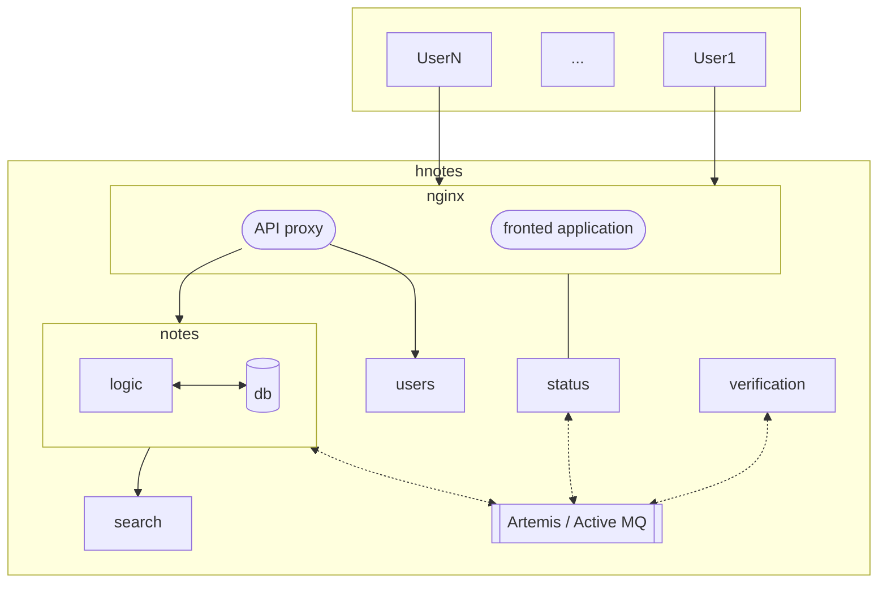

# hNOTES

The place to keep your notes and ideas organized.

## About the project

This is a playground project to explore technologies, tools and good patterns to build scalable distributed systems.
Even though it's not intended to be ever put into real production, the general aim is to keep it as close to real solutions as possible.

hNotes are experimental; the design might (and probably will) change over time, perhaps even the domain itself (memo-taking app) might morph into something else.

# Components

In order to keep the development process as simple as possible, I decided to keep all the code in a single repository.

*In a real system it would probably be best to split components into separate repositories and use git submodules, git repo or other tools to bring all the elements together*.

The current structure of the system is depicted in the diagram below:

```mermaid

flowchart TB
  direction TB
  subgraph WORLD[" "]
    direction TB
    U1["User1"]
    U2["..."]
    UN["UserN"]
  end
  subgraph HN["hnotes"]
    direction TB
    subgraph NG["nginx"]
        direction TB
        Angular(["fronted application"])
        API(["API proxy"])
    end
    US["users"]
    ST["status"]
    VE["verification"]
    SE["search"]
    subgraph NO["notes"]
        direction LR
        logic <--> db[("db")]
    end

    BR[["Artemis / Active MQ"]]

    API --> NO
    API --> US

    NO --> SE
    
    NO <-.-> BR
    VE <-.-> BR
    ST <-.-> BR 
   end

  U1 --> NG
  UN --> NG
  NG --- ST

  click Angular "https://github.com/mateusz-holenko/hnotes/tree/readme/frontend" "Frontend application source code"
```

## Frontend application

Users interact with the system via the [frontend web application](frontend) implemented in Angular.

It allows user to log into the system, view existing notes and edit them: create new ones, update or delete existing ones.

Under the hood it communicates with [Users](backend/users) and [Notes](backend/notes) services hidden behind the proxy API provided by [nginx](k8s/dockerfiles/frontend/default.conf.template).

Future plans:
- [ ] Search functionality
- [ ] Improved login form verification
- [ ] Websocket connections with [Status](backend/status) service for async updates

## Notes Service
## Users Service
## Search Service
## Verification Service
## Status Service
## Message broker
## Monitoring

# Configuration

## Docker images
## Docker compose
## Kubernetes

# Current status & future plans

## Frontend application

TODO:
* 
